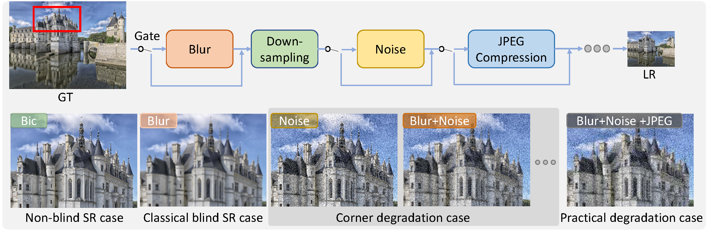

# CloserLookBlindSR
### Paper accepted by CVPR Workshop, NTIRE 2022
[Paper](https://arxiv.org/pdf/2205.04910.pdf) | [Supplementary file](https://openaccess.thecvf.com/content/CVPR2022W/NTIRE/supplemental/Zhang_A_Closer_Look_CVPRW_2022_supplemental.pdf)

### A Closer Look at Blind Super-Resolution: Degradation Models, Baselines, and Performance Upper Bounds


 By [Wenlong Zhang](https://wenlongzhang0517.github.io/), [Guangyuan Shi](https://scholar.google.com/citations?user=fL_osukAAAAJ&hl=en), [Yihao Liu](http://xpixel.group/2010/03/29/yihaoliu.html), [Chao Dong](https://scholar.google.com.hk/citations?user=OSDCB0UAAAAJ&hl=en), [Xiao-Ming Wu](http://www4.comp.polyu.edu.hk/~csxmwu/)
 

<p align="center">
  
</p>

 
## An example of the gate operation on adding blur

```python
 ############## add blur ################### 
 
 # self.opt['gate_blur_prob'] = 0.5
 
 if np.random.uniform() < self.opt['gate_blur_prob']:
     out = filter2D(self.gt, self.kernel1)
 else:
     out = self.gt
```

## Citation

Please cite us if our work is useful for your research.

```
@InProceedings{Zhang_2022_CVPR,
    author    = {Zhang, Wenlong and Shi, Guangyuan and Liu, Yihao and Dong, Chao and Wu, Xiao-Ming},
    title     = {A Closer Look at Blind Super-Resolution: Degradation Models, Baselines, and Performance Upper Bounds},
    booktitle = {Proceedings of the IEEE/CVF Conference on Computer Vision and Pattern Recognition (CVPR) Workshops},
    month     = {June},
    year      = {2022},
    pages     = {527-536}
}
```

## License

This project is released under the [Apache 2.0 license](LICENSE).

## Acknowledgement

The code is based on [BasicSR](https://github.com/XPixelGroup/BasicSR) and [Real-ESRGAN](https://github.com/xinntao/Real-ESRGAN). Thanks to [Xintao Wang](https://xinntao.github.io/).

## Contact

If you have any questions, please feel free to contact with me at zhangwenlong0517@gmail.com
